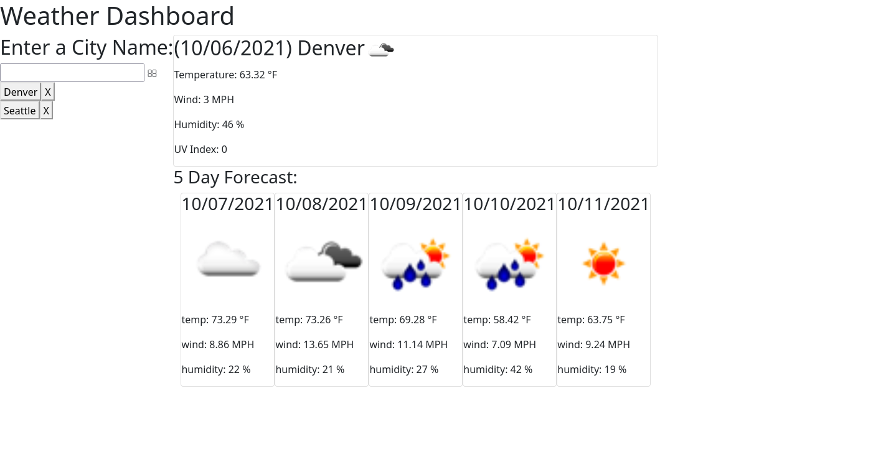

# Weather Dashboard
This is a weather dashboard the uses the OpenWeather API to search for a city and return weather information for that city. The site can be accessed [here.](https://zachary-berdell-elliott.github.io/weather-dashboard/)

## Technologies Used
* HTML
* CSS
* Javascript/Jquery
* Momentjs
* Open Weather API
* Bootstrap

## Project Purpose
The purpose of this project was to build a website that fetches data from the open weather API and outputs the current weather along with the forecast for the next five days.

## Project Features

### Search 
The user of the website can enter text into the search bar then click the button to fetch data for the city. They will be alerted with an error message if the input is not a recognized city. 

### Weather Presentation
The user is presented with the current date and current weather at the top. The user can see the temperature, wind, humdity, weather icon, and UV Index. Below that the user is presented with a five day forecast that includes the same minus the UV index.

### City Search Saving
The users input will be saved to local storage after they search for a city. A button is added that can be removed when the user clicks the 'X' next to it.

## License
MIT

Copyright 2021 Zachary Elliott

Permission is hereby granted, free of charge, to any person obtaining a copy of this software and associated documentation files (the "Software"), to deal in the Software without restriction, including without limitation the rights to use, copy, modify, merge, publish, distribute, sublicense, and/or sell copies of the Software, and to permit persons to whom the Software is furnished to do so, subject to the following conditions:

The above copyright notice and this permission notice shall be included in all copies or substantial portions of the Software.

THE SOFTWARE IS PROVIDED "AS IS", WITHOUT WARRANTY OF ANY KIND, EXPRESS OR IMPLIED, INCLUDING BUT NOT LIMITED TO THE WARRANTIES OF MERCHANTABILITY, FITNESS FOR A PARTICULAR PURPOSE AND NONINFRINGEMENT. IN NO EVENT SHALL THE AUTHORS OR COPYRIGHT HOLDERS BE LIABLE FOR ANY CLAIM, DAMAGES OR OTHER LIABILITY, WHETHER IN AN ACTION OF CONTRACT, TORT OR OTHERWISE, ARISING FROM, OUT OF OR IN CONNECTION WITH THE SOFTWARE OR THE USE OR OTHER DEALINGS IN THE SOFTWARE.
